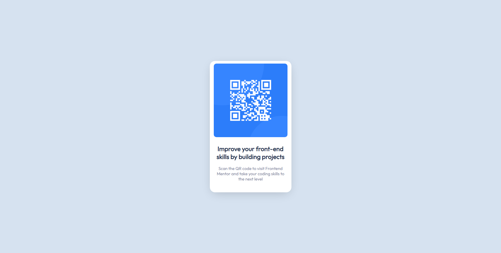

# Frontend Mentor - QR code component solution

This is a solution to the [QR code component challenge on Frontend Mentor](https://www.frontendmentor.io/challenges/qr-code-component-iux_sIO_H). Frontend Mentor challenges help you improve your coding skills by building realistic projects. 

## Table of contents

- [Overview](#overview)
  - [Screenshot](#screenshot)
  - [Links](#links)
- [My process](#my-process)
  - [Built with](#built-with)
  - [What I learned](#what-i-learned)
  - [Continued development](#continued-development)
  - [Useful resources](#useful-resources)
- [Author](#author)

## Overview
This is my first challenge from frontendmentor. I completed it only with my html and css knowledge .
In my further challenges/projects i'll refine and perfect these in categories in which i am not good at.

### Screenshot



### Links

- Solution URL: [Add solution URL here](https://github.com/Netero03/QR-code-component.git)
- Live Site URL: [Add live site URL here](https://netero03.github.io/QR-code-component/)

## My process
- Analised the order of elements and what element reside in which element.
- Then First HTML code.
- Then Second CSS code.

### Built with

- Semantic HTML5 markup
- CSS custom properties

### What I learned

- I learned how to anaylse a solution image and how to it can be made and the order of things.
- And how to apply a box shadow efficiently.

```css
.proud-of-this-css {
  box-shadow: 0px 10px 40px -10px rgba(0, 0, 0, 0.2);
}
```

### Continued development
- I want to continue focusing in areas like: 
  1. Font decoration and sizing and font weight. 
  2. Image usage/handling.
  3. Different Element sizing.
  4. Css
- In my further challenges/projects i'll refine and perfect these in categories in which i am not good at.

### Useful resources

- Internet.

## Author

- Frontend Mentor - [@Netero03](https://www.frontendmentor.io/profile/Netero03)
- Twitter - [@Netero2003](https://www.twitter.com/Netero2003?s=09)